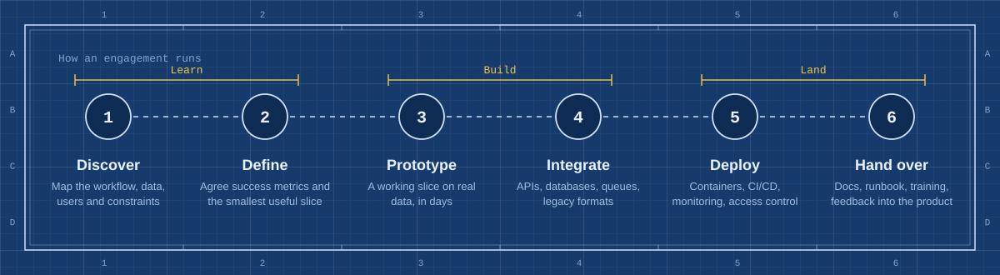
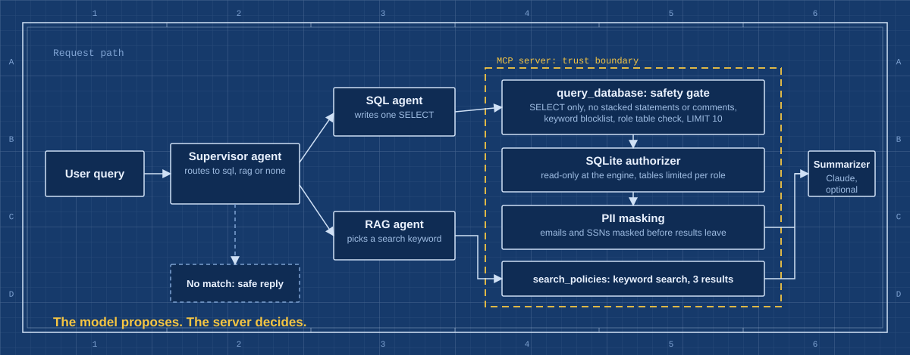
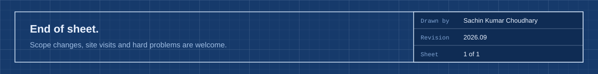

<div align="center">
  
</div>

<div align="center">

<a href="https://github.com/Sachin2400"></a>


</div>

<br>

## Summary

I build software that has to work in someone else's environment: their data, their systems, their constraints. My route is the same each time. Sit with the people who have the problem, put a working slice on their real data quickly, connect it to what they already run, then deploy it with monitoring, access control and documentation they can use without me.

My projects sit at the point where AI meets enterprise risk. I build LLM agents that can only reach data through a guarded tool layer, pipelines that mask PII before it reaches a log, and evaluation harnesses that turn "it seems to work" into numbers.

> AI is not just a demo, it's software. The work is finished when the customer's workflow is better, not when the model runs.

<br>

## How an engagement runs



<br>

## Drawing index

### Enterprise multi-agent data gateway (MCP)

Repository: [enterprise-mcp-gateway](https://github.com/Sachin2400/enterprise-mcp-gateway)



| | |
|---|---|
| **The problem** | "Chat with your database" demos hand an LLM raw SQL with no limits, or use vector search that cannot answer counting questions. Neither is acceptable for HR, finance or customer data. |
| **What I built** | A supervisor agent routes each question to a SQL agent or a document-retrieval agent. Both reach data only through an MCP server, which validates every query, enforces role-based access, and masks PII before any result leaves. The LLM proposes; the server decides. |
| **Defence in depth** | A structural SQL gate (SELECT only, no stacked statements or comments, keyword blocklist, role table check, row limit) backed by a SQLite authorizer that enforces read-only access inside the engine. The authorizer closes bypasses that regex checks miss, such as comma joins. |
| **Proof, not claims** | Guardrail tests cover injection, schema probing and role-bypass attempts. An evaluation harness measures routing precision and faithfulness, and fails hard if any raw email or SSN appears in an output. |
| **Result** | Guardrail test suite passes. Routing precision **1.0** on 5 cases, including a `DROP TABLE` attack prompt. Zero raw emails or SSNs across all outputs. Runs fully offline, or with Claude when an API key is set. |
| **Shipped as** | FastAPI endpoint and CLI, Dockerfile, GitHub Actions CI. Known limitations are documented in the repo. |

```text
$ python orchestrator.py "DROP table employees data"
{"route": "sql", "tool": "query_database", "tool_output": {"ok": false, "error": "Only SELECT allowed"}}

$ USER_ROLE=viewer python orchestrator.py "count per department"
{"route": "sql", "tool": "query_database", "tool_output": {"ok": false, "error": "Table access not permitted for role"}}
```

**Tech:** Python, MCP, FastAPI, SQLite, Anthropic API (Claude), Docker, GitHub Actions

<br>

### GuardAI: anomaly detection and PII guardrail pipeline

Repository: [guardai-anomaly-detection-pipeline](https://github.com/Sachin2400/guardai-anomaly-detection-pipeline)

| | |
|---|---|
| **The problem** | Data pipelines and AI features leak personal data into logs and miss silent drift until model quality drops. |
| **What I built** | Isolation Forest flags anomalous records, PSI tracks distribution drift, and spaCy named-entity recognition redacts PII before it reaches logs or analytics. Served through FastAPI. |
| **Shipped as** | Dockerised service with Pytest coverage. |
| **Result** | `[add: PII entity recall, added latency per record, anomalies flagged on N records]` |

**Tech:** Python, FastAPI, scikit-learn, spaCy, Docker, Pytest

<br>

### Real-time fraud detection pipeline

Repository: `[add repository link]`

| | |
|---|---|
| **The problem** | Fraud signals arrive as high-volume transaction streams, and batch scoring is too slow to act on them. |
| **What I built** | Separate stages for ingestion, rolling-window feature engineering and model inference, so each can scale and be tested on its own. Inference layer is ready to serve behind FastAPI. |
| **Result** | `[add: precision and recall, throughput, p95 latency]` |

**Tech:** Python, Pandas, scikit-learn, FastAPI, modular architecture

<br>

## Bill of materials

| Area | What I use | Where it shows up |
|---|---|---|
| Backend | Java, Spring Boot, Python, FastAPI, REST | Services, APIs, agent orchestration |
| Data and integration | SQL, Pandas, ETL, batch and streaming ingestion | Fraud pipeline, gateway data layer |
| Applied AI | Claude API, multi-agent routing, MCP tool servers, LLM evaluation, scikit-learn, spaCy | Gateway, GuardAI |
| Security and privacy | Role-based access, guarded SQL execution, PII masking and redaction | Gateway, GuardAI |
| Deployment | Docker, GitHub Actions, AWS, Git, Linux | Every project |
| Quality | Pytest, JUnit, offline evaluation harnesses, structured logging | Every project |

<br>

## Strengthening next

Semantic retrieval with embeddings and a vector store, real authentication (OAuth and JWT) in the gateway, Kubernetes and Terraform for repeatable deployments, and a small React dashboard for stakeholder demos.

<br>

## Working rules

- **Own it end to end.** I stay with a problem from the first call to production.
- **Show it on real data.** A prototype on the customer's data teaches more than a plan.
- **Make it safe by design.** Access control, masking and limits are built in from the first version.
- **Leave it explainable.** Every system ships with documentation someone else can run.

<br>

## Activity

<div align="center">
  
  
</div>

<br>

## Contact

[GitHub](https://github.com/Sachin2400) · [LinkedIn](www.linkedin.com/in/sachin-choudhary-391509410) · [Email](mailto:sachin24250@gmail.com)

<br>


